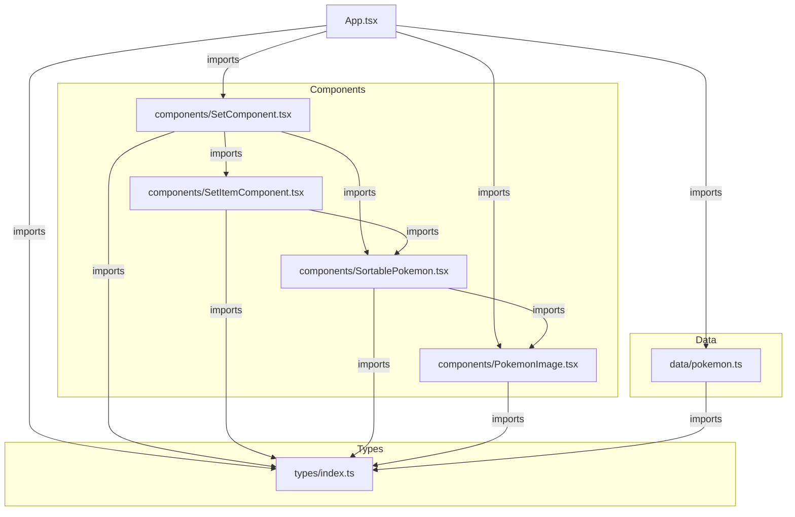

# スクリプト関係図

このプロジェクトの主要なスクリプト（コンポーネント、データ、型定義）の依存関係図です。

## 解説

*   **App.tsx**: アプリケーションのエントリーポイント。全体の状態管理とレイアウトを行います。
*   **components/**:
    *   **SetComponent**: 1つの「セット」（ターゲット、有利ポケモンなどのグループ）を表示・管理します。
    *   **SetItemComponent**: セット内の各「項目」（ターゲット、有利など）を表示・管理します。
    *   **SortablePokemon**: ドラッグ&ドロップ可能なポケモンアイコンのラッパーです。
    *   **PokemonImage**: ポケモンの画像を表示する基本コンポーネントです。
*   **data/pokemon.ts**: 全ポケモンの初期データ（名前、ロール、画像パスなど）を定義しています。
*   **types/index.ts**: アプリケーション全体で使用される型定義（Pokemon, Set, Roleなど）が集約されています。
