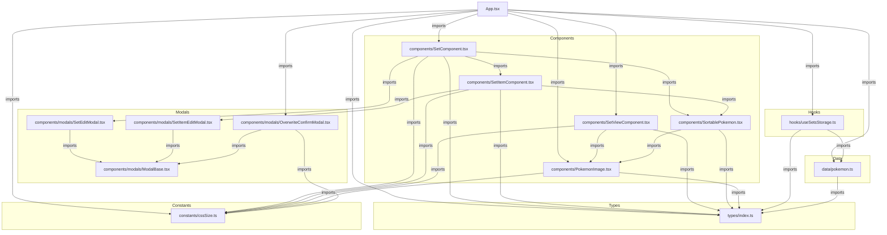

# スクリプト関係図

このプロジェクトの主要なスクリプト（コンポーネント、フック、データ、型定義）の依存関係図です。

## 解説

*   **App.tsx**: アプリケーションのエントリーポイント。全体の状態管理とレイアウト（ヘッダー、モード切り替え、ドラッグ＆ドロップ処理）を行います。
*   **hooks/useSetsStorage.ts**: ローカルストレージおよびURLパラメータからのデータ読み込み・保存・共有ロジックを集約したカスタムフックです。
*   **components/**:
    *   **SetComponent**: 「編集モード」で1つのセット（ターゲット、有利ポケモンなどのグループ）とキャラクタープールを表示・管理します。
    *   **SetItemComponent**: セット内の各「項目」（ターゲット、有利など）を表示・管理します。
    *   **SetViewComponent**: 「閲覧モード」でセットをコンパクトなグリッド表示（Pinterest風）にします。
    *   **SortablePokemon**: ドラッグ&ドロップ可能なポケモンアイコンのラッパーです（`dnd-kit`を使用）。
    *   **PokemonImage**: ポケモンの画像をRoleに応じた背景色と共に表示する基本コンポーネントです。
*   **components/modals/**:
    *   **ModalBase**: モーダルの共通レイアウトや背景クリック・Escapeキーでの閉じる処理を提供します。
    *   **SetEditModal**: セット名とセット全体の色などを編集するモーダルです。
    *   **SetItemEditModal**: 項目名（「ターゲット」など）を編集するモーダルです。
    *   **OverwriteConfirmModal**: URLからデータを読み込んだ際、自分のローカルデータで上書きするか維持するかを確認するモーダルです。
*   **constants/cssSize.ts**: レスポンシブ対応のためのブレイクポイント（PC、モバイルなど）およびサイズ調整ユーティリティ関数（`Size`, `VariableSize`）を提供します。
*   **data/pokemon.ts**: 全ポケモンの初期データ（名前、ロール、画像パスなど）を定義しています。画像は `/icons/` 配下のものを参照します。
*   **types/index.ts**: アプリケーション全体で使用される型定義（Pokemon, Set, Roleなど）が集約されています。
